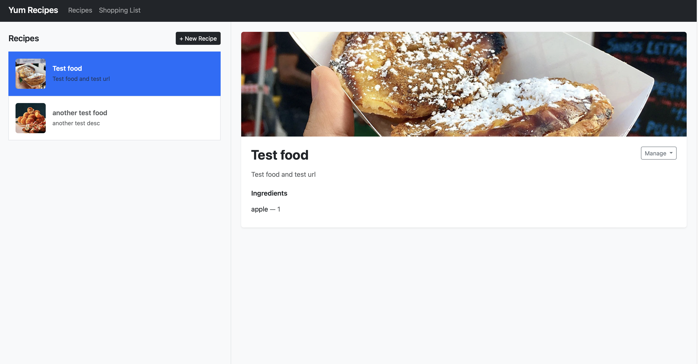
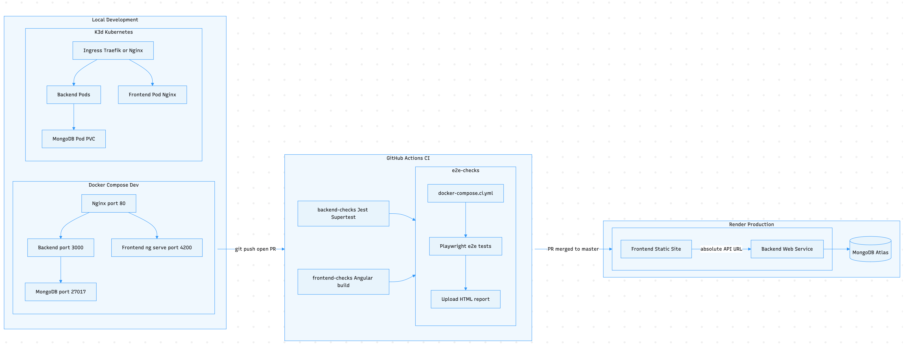
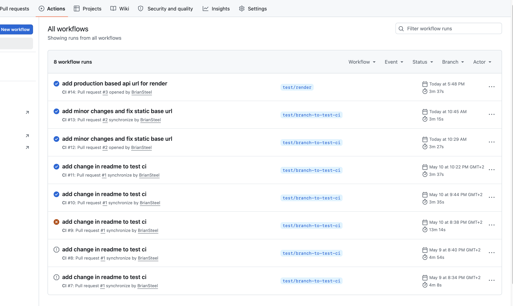
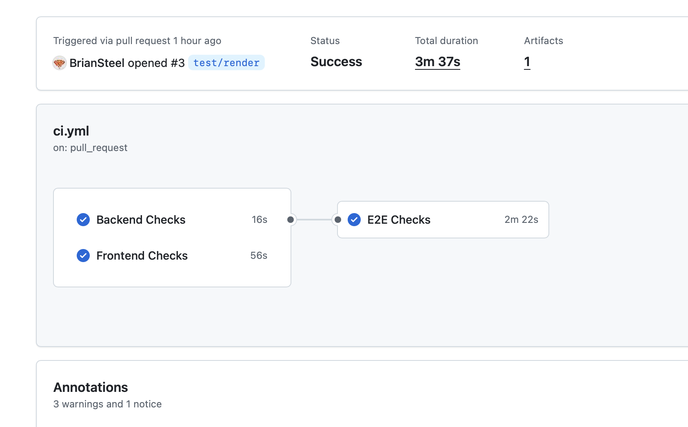
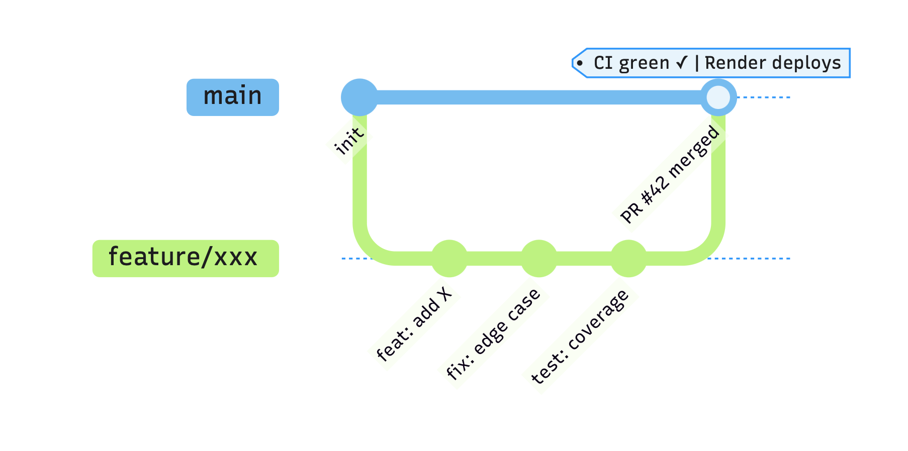

# Yum Recipes

<p align="center">
  
</p>

<p align="center">
  <a href="https://yum-recipes-frontend.onrender.com">🔗 Live Demo</a> &nbsp;|&nbsp;
  <a href="https://yum-recipes.onrender.com/api/recipes">🔗 API</a>
</p>

Production-grade engineering practices on a simple recipe app. The domain is intentionally simple (a recipe app) so the focus stays on the engineering practices rather than business logic — the same patterns, tooling and workflows I use day-to-day on real systems.

**This is not a demo or toy app** — it reflects my actual working approach:
- Containerisation with Docker and Docker Compose
- Kubernetes orchestration with Kustomize overlays
- CI/CD with GitHub Actions
- Automated testing at unit, e2e and performance levels
- Infrastructure-as-code for all environments

In production I work with Google Cloud (GKE, Cloud Run, etc.). For this simulation, Render stands in as the deployment target to keep the setup self-contained and free — the CI/CD pipeline structure, branching strategy and workflow are the same regardless of where it deploys.

Intentionally out of scope (not because I haven't done it, but because it would add noise without adding signal here):
- Monitoring / observability (Prometheus, Grafana)
- Log aggregation (ELK, Loki)
- Authentication / RBAC
- Rate limiting
- HTTPS / TLS certificates

---

## Architecture

<p align="center">
  
</p>

---

## Stack

| Layer | Technology |
|---|---|
| Frontend | Angular 11 |
| Backend | Node.js / Express |
| Database | MongoDB |
| Reverse Proxy | Nginx |
| Containerisation | Docker + Docker Compose |
| Orchestration | Kubernetes (K3d / K3s) |
| CI | GitHub Actions |
| CD | Render (frontend + backend) |

---

## Prerequisites

- Docker Desktop

For Kubernetes:
- `brew install k3d`
- `brew install kubectl`

---

## Getting Started

### Docker Compose (dev)

```bash
npm run docker:dev
npm run seed:recipes
npm run seed:shopping-list
```

### Kubernetes (local K3d)

```bash
npm run k8s:traefik       # deploy with Traefik ingress
npm run k8s:nginx         # deploy with Nginx ingress
```

App runs at http://localhost:80

---

## Commands

### Docker Compose

| Command | What it does |
|---|---|
| `npm run docker:dev` | Start dev stack |
| `npm run docker:dev:build` | Build images and start |
| `npm run docker:dev:down` | Stop dev stack |
| `npm run docker:dev:restart` | Restart dev stack |
| `npm run docker:scale` | Start with 3 backend replicas |
| `npm run seed:recipes` | Seed recipes |
| `npm run seed:shopping-list` | Seed shopping list |
| `npm run install:all` | Install all dependencies (backend, frontend, e2e, perf) |

### Tests

| Command | What it does |
|---|---|
| `npm run test:backend` | Run Jest unit tests |
| `npm run test:e2e` | Run Playwright e2e tests (requires `nvm use 24`) |
| `npm run test:perf` | Run performance tests (requires app on localhost:80) |

### Kubernetes

| Command | What it does |
|---|---|
| `npm run k8s:traefik` | Deploy with Traefik (fast, no build, no tests) |
| `npm run k8s:traefik:test` | Deploy + backend tests + smoke tests + perf tests |
| `npm run k8s:nginx` | Deploy with Nginx (fast, no build, no tests) |
| `npm run k8s:nginx:test` | Deploy + backend tests + smoke tests + perf tests |

For full control use the scripts directly — see [k8s/README.md](k8s/README.md).

---

## API Routes

| Method | Route | Description |
|---|---|---|
| GET | `/api/recipes` | Get all recipes |
| POST | `/api/recipes` | Create a recipe |
| PUT | `/api/recipe/:id` | Update a recipe |
| DELETE | `/api/recipe/:id` | Delete a recipe |
| GET | `/api/shopping-list` | Get all shopping list items |
| POST | `/api/shopping-list` | Add a shopping list item |
| PUT | `/api/shopping-list/:id` | Update a shopping list item |
| DELETE | `/api/shopping-list/:id` | Delete a shopping list item |

---

## Project Structure

```
├── backend/
│   ├── config/            .env.dev, .env.test, .env.prod, .env.example
│   ├── migration-scripts/ seed-recipes.js, seed-shopping-list.js
│   ├── models/            schema.js, shoppingListSchema.js
│   ├── tests/             recipes.test.js (Jest + Supertest)
│   ├── app.js             Express routes
│   ├── index.js           Server entry point
│   ├── Dockerfile         Production image
│   └── Dockerfile.dev     Dev image
├── frontend/              Angular 11 source
│   ├── Dockerfile         Production image (multi-stage: Node 16 build + Nginx serve)
│   └── Dockerfile.dev     Dev image (ng serve on Node 16)
├── e2e/                   Playwright tests
├── perf/                  Performance tests (autocannon)
├── nginx/
│   ├── nginx.dev.conf     Reverse proxy for Docker Compose dev (proxies to ng serve on port 4200)
│   ├── nginx.ci.conf      Reverse proxy for Docker Compose CI/prod (proxies to Nginx on port 80)
│   └── frontend.conf      Static file server for K8s frontend pod
├── k8s/
│   ├── scripts/           Deploy scripts (Traefik + Nginx variants)
│   ├── base/              Shared K8s manifests
│   ├── overlays/          Environment-specific patches (traefik, nginx, dev, prod)
│   └── namespace.yml
├── docker-compose.dev.yml Dev stack
├── docker-compose.prod.yml Production stack
└── package.json           Root npm scripts
```

---

## Environment Variables

| Variable | Description | Example |
|---|---|---|
| `NODE_ENV` | Environment | `dev`, `test`, `prod` |
| `PORT` | Backend port | `3000` |
| `MONGO_URI` | MongoDB connection string | `mongodb://mongo-dev:27017/project_yum_recipes` |

---

## Docker Compose

| File | Use |
|---|---|
| `docker-compose.dev.yml` | Dev — live mounts, ports exposed, Node 16 frontend |
| `docker-compose.prod.yml` | Prod demo — baked images, port 80 only |
| `docker-compose.ci.yml` | CI — production images, no bind mounts, used by GitHub Actions |

> `docker-compose.dev.yml` uses bind mounts (`./frontend:/app`) for live code reload. This requires an anonymous volume on `/app/node_modules` to protect the container's Linux node_modules from being overwritten by the local macOS ones at runtime. CI uses `docker-compose.ci.yml` which builds clean images with no mounts — this problem doesn't exist there.

---

## Kubernetes

Local K8s setup using K3d (K3s inside Docker). Supports both Traefik and Nginx ingress controllers. Uses Kustomize for environment management.

See [k8s/README.md](k8s/README.md) for full Kubernetes docs.

> K8s deploy scripts are for local K3d only. For cloud K8s (EKS, GKE, AKS), use GitHub Actions CD or ArgoCD. For edge devices, use K3s directly.

---

## CI/CD

**`ci.yml`** — runs on every PR (any branch): Jest tests, frontend build, Playwright e2e

Render auto-deploys on push to `master` via its GitHub integration — no deploy workflow needed.

<p align="center">
  
  &nbsp;
  
</p>

> K8s deploy scripts are for local K3d only. For cloud K8s (EKS, GKE, AKS), use GitHub Actions CD or ArgoCD. For edge devices, use K3s directly.

### Playwright Report

After each CI run, the Playwright HTML report is uploaded as a GitHub Actions artifact named `playwright-report`. To view it:

1. Go to the Actions tab on GitHub
2. Click the relevant workflow run
3. Download `playwright-report` from the Artifacts section
4. Extract the zip and open `index.html` in a browser

The report includes per-test pass/fail status, screenshots on failure, and traces for retried tests.

### Required Secrets

None — Render auto-deploys on push to `master` via GitHub integration.

---

## Live Demo

| | URL |
|---|---|
| Frontend | https://yum-recipes-frontend.onrender.com |
| Backend API | https://yum-recipes.onrender.com/api/recipes |

---

## Cloud Deployment

| Layer | Service |
|---|---|
| Frontend | Render (Static Site) |
| Backend | Render (Web Service) |
| Database | MongoDB Atlas (M0 free tier) |

Auto-deploys on every push to `master` — frontend redeploys only when `frontend/` changes, backend only when `backend/` changes (configured via Render Build Filters).

> Free tier backend spins down after 15 minutes of inactivity. First request after idle takes ~30s (cold start).

---

## Branching Strategy

<p align="center">
  
</p>
